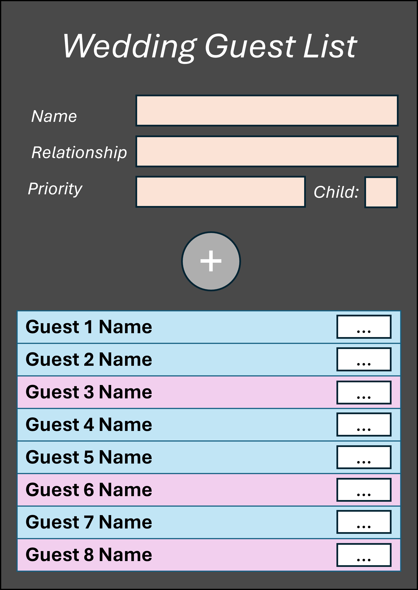
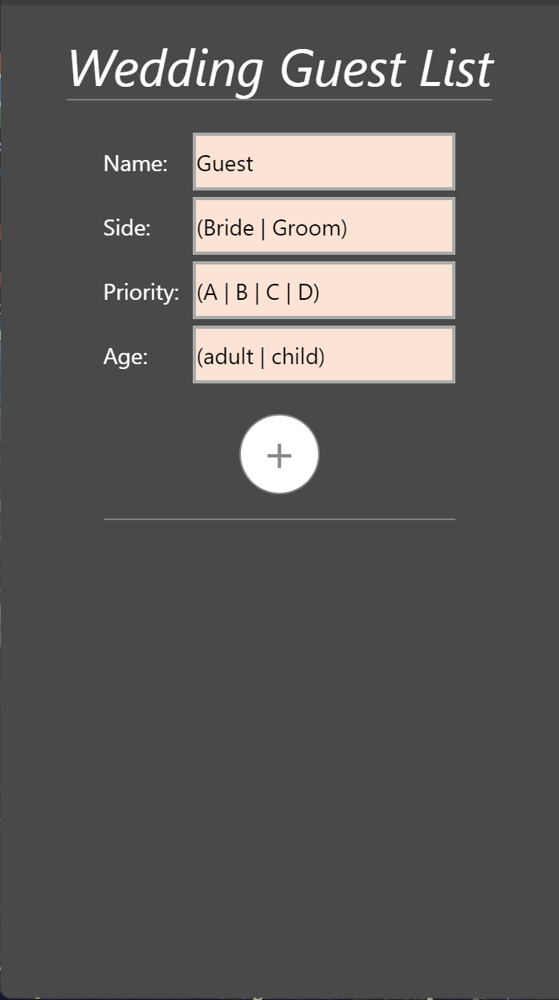
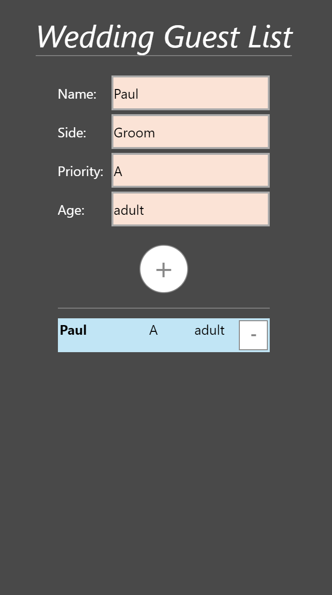
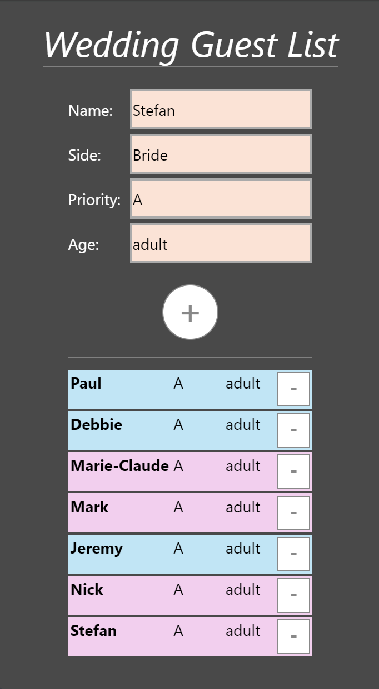
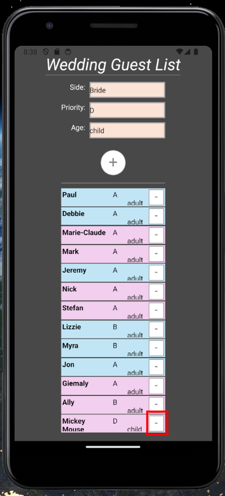
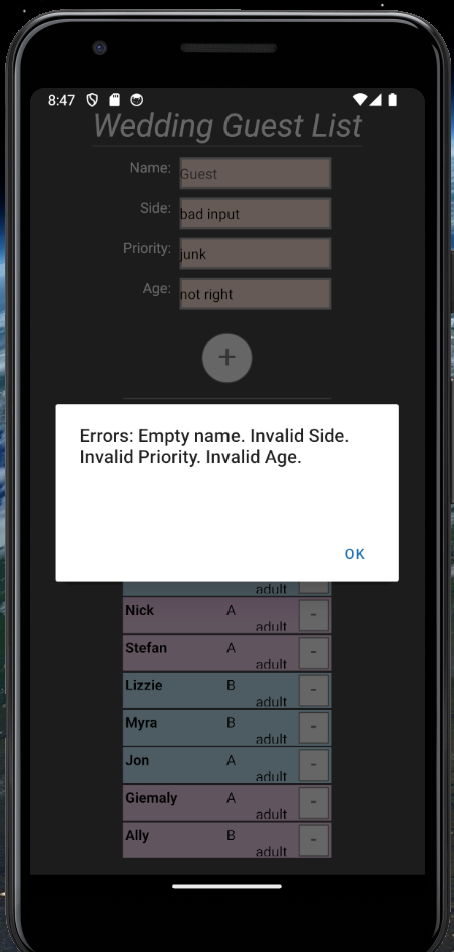

# INFO 670: Cross-platform Mobile Development

Author: Zachary Rahn

## Apps 

 * [Assignment 1: MyFirstReactNative](MyFirstReactNative)
 * [Assignment 2: assignment2list](assignment2list)

### Assignment 2

#### Design and Purpose

**Purpose Statement:** The app in assignment 2 is managing a Wedding Invitation/Guest List. My fiance and I are planning our wedding, and currently have a list in Google Sheets. We've found that Google Sheets is not very easy to manage from a mobile application (deleting guests, analyzing the invitees, etc.). For this project, I decided to track our Guest list with this mobile application. The app has the following functionality.

1. Add a new guest to the guest list
    * Each guest must have the following attributes:
        * Name
        * WIth which side they have a relationship (Bride or Groom)
        * Priority (Are they on the A list?)
        * Whether they are an adult or a child
2. Delete a guest from the list
    * Each guest in the list has a `-` button to remove their name from the list

<figure>
  
  <figcaption>Original Design</figcaption>
</figure>
 

 

#### Basic Use

**Functionality/Explanations:**

*Text Input*

* The user can enter guest information in `<TextInput>` components with a `<Text>` label prompting for the information.
* The following information can be entered as text input:
    1. Name
    2. Side
    3. Priority
    4. Age

 

*Add Guest Button*

* When the user clicks the `+` `<Pressable>` button, the app will store the guest information into a new `<Guest>` component as properties after performing some simple input validation (see below). The button will then append the `guests` list with the new `guest` information.

 

*Guest Item*

* The `<Guest>` component stores the `name`, `priority`, `side`, and `age` properties in the component
    * `name` (bolded), `priority`, and `age` are displayed as text in the list
    * `side` influences the item's color (pink or blue)
* Each `<Guest>` component also has a `-` `<Pressable>` button with an `onClick` handler to delete the guest
    * This function takes in the guest `name` as an argumet

 

*Guest List*

* The `<GuestList>` component is composed of:
    1. Functions for adding (**_addGuest()**) and deleting (**_deleteGuest(name)**) guests.
    2. The **text input** fields (storing the data in a `guest` `state` dictionary) and **Add Guest** button.
    3. A list of `<Guest>` object (stored in a `guests` `state` list)

 

*Delete Guest Buttons*

* Each `<Guest>` component has a **_deleteGuest** button. The component is set to pass the `guest.name` to the **_deleteGuest** function as an argument.
* The **_deleteGuest(name)** function then filters the guest list by the items to remove the item(s) with that guest's name.

 

*Error Handling*

* The following error handling is performed prior to adding a guest to the guest list.
    1. Verifying that the guest's `name` is provided (required)
    2. Validating that the guest's `side` is either "Bride" or "Groom"
    3. Validating that the guest's `priority` is either "A", "B", "C", or "D"
    4. Validating that the guest's `age` is either "adult" or "child"
* The app will aggregate all the errors that the user enters and alert them; allowing them to fix the issue.

 

*Style Sheet*

* A React Native `StyleSheet` component is created to enhance the app's display using the flexbox methodology.

 

 

#### Screenshots

The app was tested with both the Web emulator and Android emulator. The screenshots below are from both platforms.

<figure>
  
  <figcaption>Initial App</figcaption>
</figure>
 

<figure>
  
  <figcaption>Addding a Guest</figcaption>
</figure>
 

<figure>
  
  <figcaption>Guest List</figcaption>
</figure>
 

<figure>
  
  <figcaption>Scroll List & Delete Guest</figcaption>
</figure>
 

<figure>
  
  <figcaption>Error Handling</figcaption>
</figure>
 
