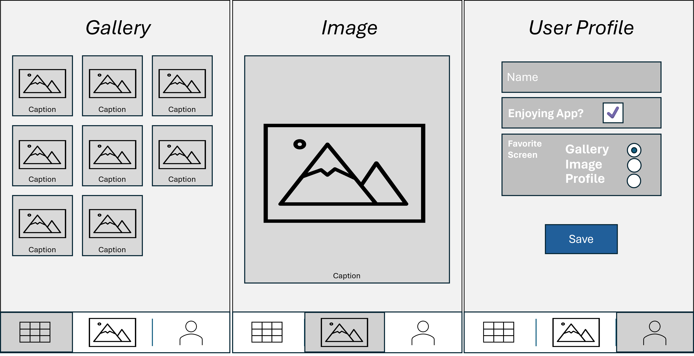
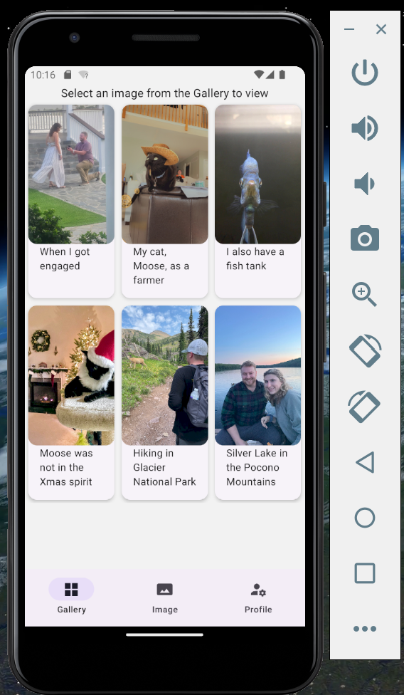
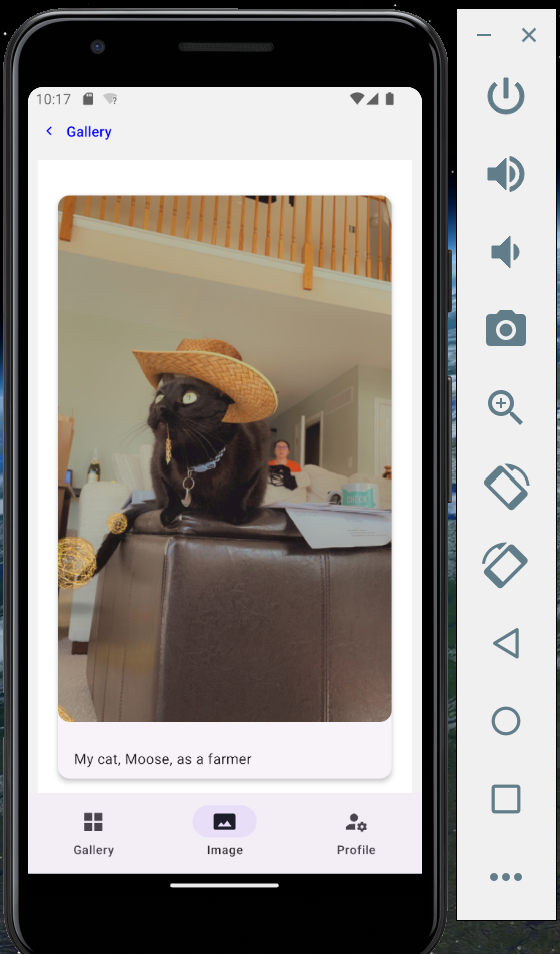
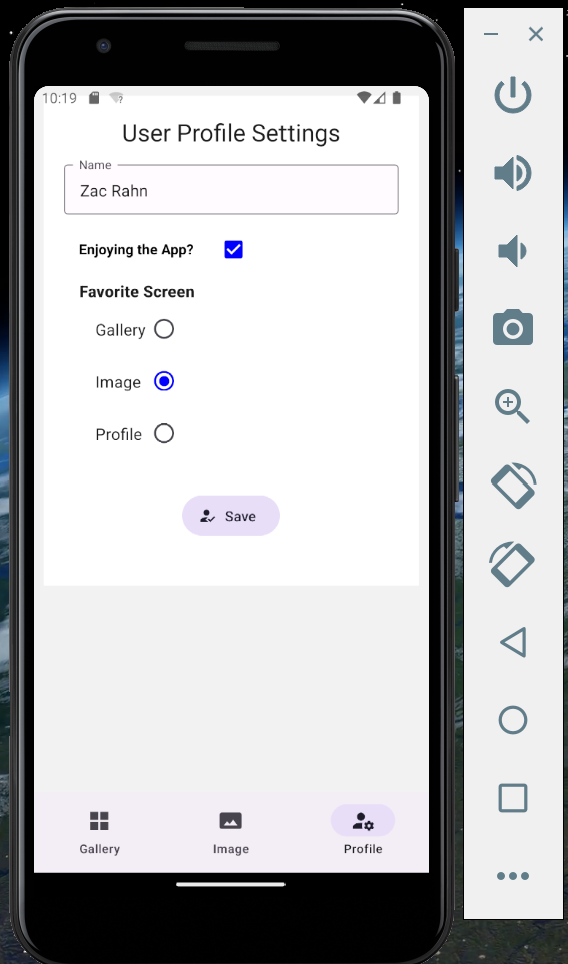
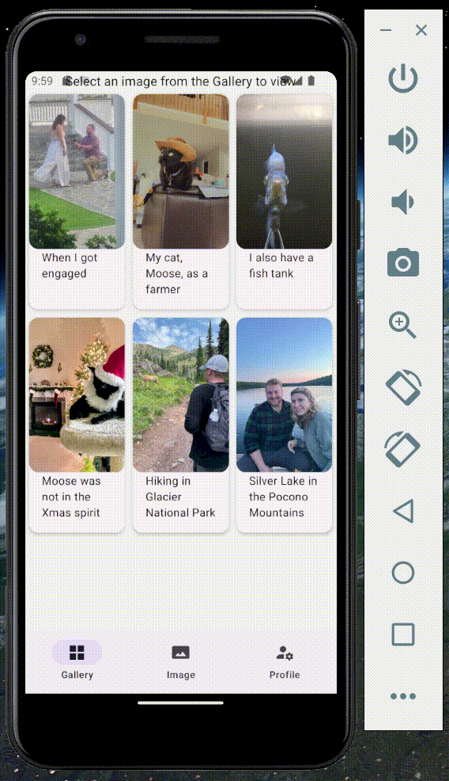

# Assignment 3

## Design and Purpose

**Purpose Statement:** The app in assignment 3 displays a photo gallery. The app has 3 screens: a *Gallery* screen, an *Image* screen, and a *User Profile* screen. The target audience for this app is a user who enjoys sharing memories, sharing experiences, and scrapbooking.

<figure>
  
  <figcaption>Initial Design</figcaption>
</figure>
 

 

## Basic Use

**Functionality/Explanations:**

*The app has the following functionality.*

1. Images and captions are displayed in the *Gallery* page. A user can select an image.
    * When selecting an image, the user navigates to the *Image* screen where the image is displayed at a larger resolution
2. In the *Image* tab, the user can navigate back to the *Gallery* with be *< Gallery* back button at the top
3. In the *Profile* screen
    * The user can enter the following profile information:
        * Name (TextInput)
        * Whether they are enjoying the app (Checkbox)
        * Select which screen is their favorite (RadioButton.Group)
    * The *Save* button persists the data locally using React's *AsyncStorage* method
4. The user can also navigate through the app screens with the BottomNavigation.Bar 

 

*Error Handling*

* The following error handling is performed prior to adding a guest to the guest list.
    1. Verifying that the guest's `name` is provided (required)
    2. Validating that the guest's `side` is either "Bride" or "Groom"
    3. Validating that the guest's `priority` is either "A", "B", "C", or "D"
    4. Validating that the guest's `age` is either "adult" or "child"
* The app will aggregate all the errors that the user enters and alert them; allowing them to fix the issue.

 

*Style Sheet*

* This app uses *React Native Paper* for styling with a *Light Theme* and a custom React Native *StyleSheet*.

 

## Screenshots

The app was tested with both the Web emulator and Android emulator. The screenshots below are from both platforms.

<figure>
  
  <figcaption>Gallery Screen</figcaption>
</figure>
  

<figure>
  
  <figcaption>Image Screen</figcaption>
</figure>
  

<figure>
  
  <figcaption>Profile Screen</figcaption>
</figure>
  

<figure>
  
  <figcaption>Demo</figcaption>
</figure>
  
