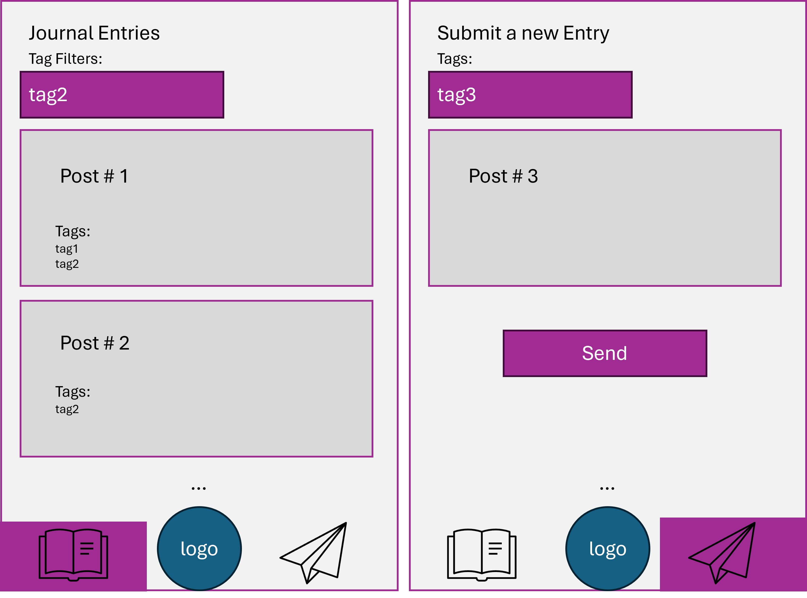

# Assignment 4 - Journal App

Author: Zachary Rahn (zr66)

## Background

The Journal App is a React Native mobile app with functionality to write & store posts and to read those posts at a later time. This app will send information from the mobile app to a backend API that connects to a DB to store the data. The app also requests, queries and returns those posts to the user for reading. It is important to store and persist the data so that it can be accessed later (maybe even after a significant amount of time passes). Journaling has been a popular activity for teenagers, those who want to practice creative writing, or keep track of day-to-day activities.

## Design

<figure>
  
  <figcaption>Initial Design</figcaption>
</figure>

## React Native Front-end

[./messaging-ui](messaging-ui)

The front end has two screens a **postScreen** and a **readScreen**.

The post screen has 3 major components:
 * A multi-line *TextInput* box to write a longer journal entry
 * Multiple *TextInput* boxes to add tags (always showing one additional box than populated so the user can easily add a new tag)
 * A Post Button to send the information to the DB via the backend API

The read screen has two major components:
 * Mutliple InputText boxes to filter journal entries by given tag(s)
 * Multiple Cards showing the content of the post and the tags listed

Navigation occurs between pages through the BottomTabNavigator. The tab on the left navigates to the readScreen, while the tab on the right navigates to the postScreen.

<figure>
  
  <figcaption>Screen Capture Demo</figcaption>
</figure>

## Node.js Backend Server APIs

[./node-backend](node-backend)

There are two server APIs: one for sending data and updating the DB and another for querying the DB and returning results.

**/newMessage**
 * Checks to see if the user sent a “message” field in the data body which is passed in as JSON
Connects to MongoDB
 * Calls insertOne to add a new document to the database

 Example POST Request:
 ```bash
curl -x POST -H 'Content-Type: application/json' \
    -d '{ "message": "Hello world.", "tags": ["test1", "test2" ] }' \
    http://node.cci.drexel.edu:9331/newMessage
```

Response
```json
 {"status": 200 }
```

(status codes will differ if the data is formatted incorrectly or a server error is encountered)

**/messages** (optional param: tag=(comma,separated,list))
 * If no tags are passed in, the API queries all messages in the DB
 * If tags are present, the API queries the DB for any message with any of the tags passed in and returns the response.

 Example GET Request without params:
 ```bash
curl -x GET http://node.cci.drexel.edu:9331/messages
```

Response
```json
{ "messages": [
    { "_id": "66611ec505ca4d21aadd37e4",
      "message": "Hello world.",
      "tags": ["test1", "test2"]
    },
    { "_id": "66611edf05ca4d21aadd37e5",
      "message": "Post number 2",
      "tags": ["test2"]
    }
  ],
  "status": 200
}
```

 Example GET Request with params:
 ```bash
curl -x GET http://node.cci.drexel.edu:9331/messages?tags=test1,test3
```

Response
```json
{ "messages": [
    { "_id": "66611ec505ca4d21aadd37e4",
      "message": "Hello world.",
      "tags": ["test1", "test2"]
    }
  ],
  "status": 200
}
```

## MongoDB database

### `messages` Collection Schema

The messages Collection an _id field and two data fields (a `message` string, and a `tags` array that holds a list of strings). The benefit of using MongoDB is this data can easily be stored in one collection whereas this would require two tables in a SQL database for the many-to-one relationship of tags in a message.

```
{
    "_id": str,
    "message": str,
    "tags": [str]
}
```

```
>>> Object.keys(db.messages.findOne())
[ '_id', 'message', 'tags’ ]
```

### MongoDB functions

**`insertOne`** is used to insert a message to the db
```node
dbo.collection("messages").insertOne(messageData, function(err, dbResponse) { ... }
```

**`find`** is used to query results
```node
dbSearch = dbo.collection('messages').find()
```

The **`$in`** operator is used to look for documents containing any of the requested tags
```node
dbSearch = dbo.collection('messages').find({"tags": {$in: tagFilter}})
```
