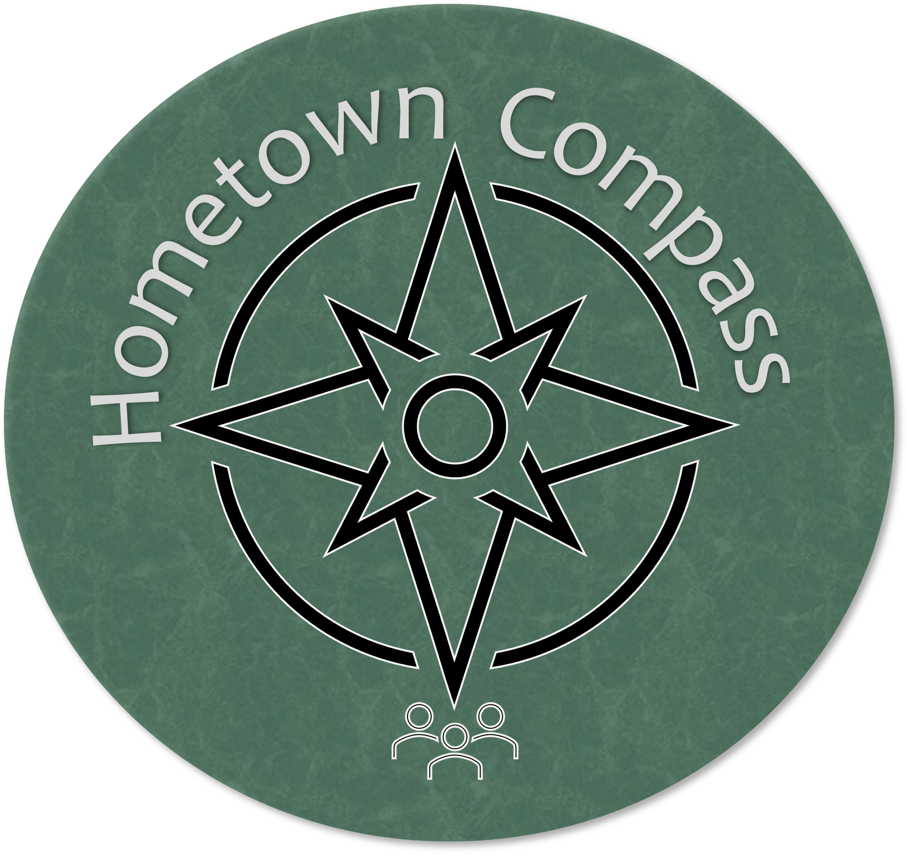
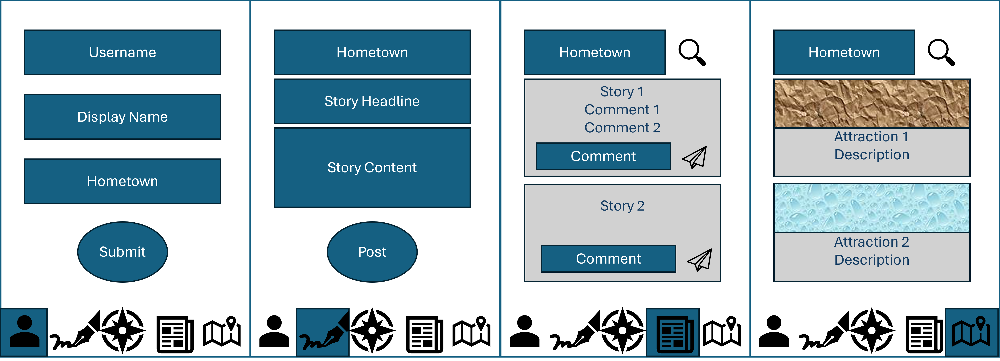
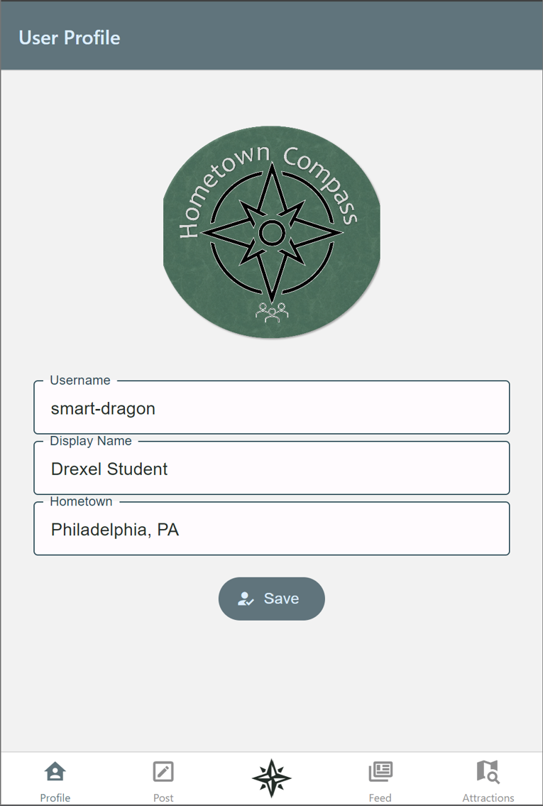
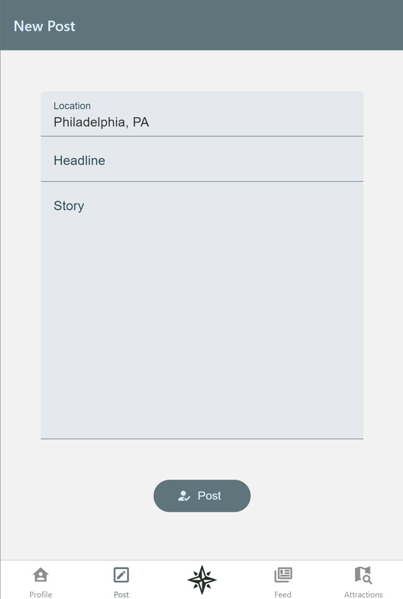
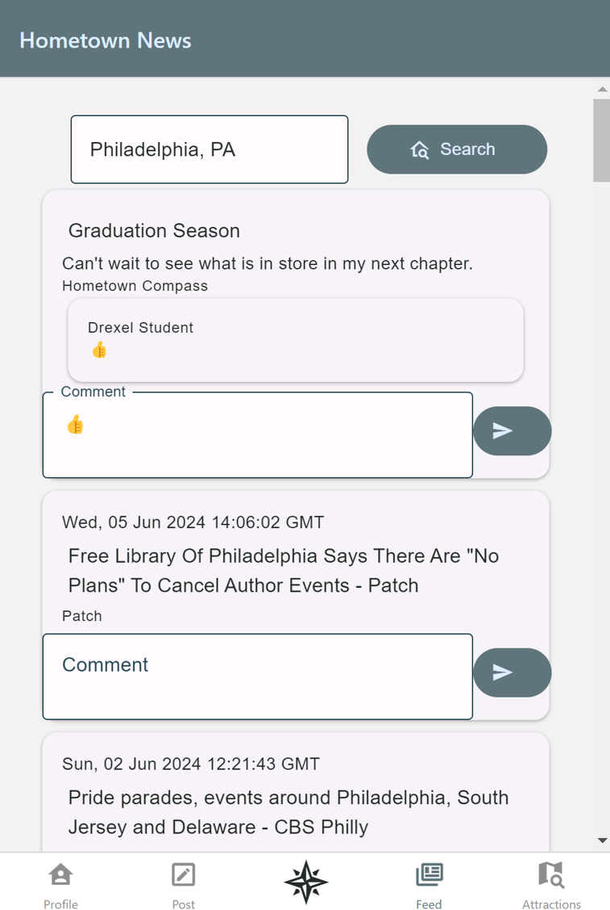
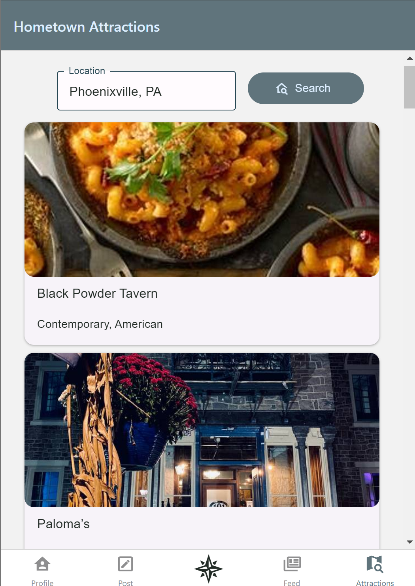

# Final Project - Hometown Compass

Zachary Rahn - zr66

<figure>
  
</figure>

## Design and Purpose

The purpose of the app is to create a platform for sharing news, events, and collaboration between residents of local communities. As the world has become more connected, local newspapers have struggled to keep up with the giant news corporations, This app could would help communities and provide a sense of connection to the nearby people and small businesses.

<figure>
  
  <figcaption>Initial Design</figcaption>
</figure>

## Features

**React Native front end**
 * User profile input data stored
 * Story posts stored and tagged with a location
 * Feed querying local news including user posts
 * Local attractions to browse through

**Third Party API Integration**
 * Google News
 * Amadeus Attractions
 * Geocoding (converting location strings to lat/lon coordinates)

**Node.js backend service**
 * Marshalling and formatting data from its origin to its destination (Third-party or MongoDB)

**MongoDB**
 * Storing user data & story posts/comments

### React Native Front-end

<figure>
  
  <figcaption>User Profile</figcaption>
</figure>
<figure>
  
  <figcaption>Local Story Post Screen</figcaption>
</figure>
<figure>
  
  <figcaption>Local News Feed Screen</figcaption>
</figure>
<figure>
  
  <figcaption>Local Attractions Screen</figcaption>
</figure>
<figure>
  
  <figcaption>**Demo**</figcaption>
</figure>

### Third-Party APIs

**Google News API**

GET Request: https://news.google.com/rss/search?q=local+news+Phoenixville,+PA&hl=en-US&gl=US&ceid=US:en&when=7d
```xml
<item>
    <title>News Article</title>
    <link>Website URL</link>
    <guid>ID</guid>
    <pubDate>Thurs, 06 Jun 2024 08:00:00 GMT</pubDate>
    <description>Blurb<description>
    <source>Newspaper</source>
</item>
```

**Amadeus Attractions API**

GET Request: https://test.api.amadeus.com/v1/shopping/activities?longitude=-3.69170868&latitude=40.41436995&radius=1
```json
{ "data": [
    { "name": "Skip-the-line tickets to the Prado Museum",
      "shortDescription": "Book your tickets for the Prado Museum in Madrid, discover masterpieces by Velázquez, Goya, Mantegna, Raphael, Tintoretto and access all temporary exhibitions.",
      "geoCode": {
        "latitude": "40.414000",
        "longitude": "-3.691000"
      },
      "pictures": [ "https://images.musement.com/cover/0001/07/prado-museum-tickets_header-6456.jpeg?w=500" ],
      "price": { "currencyCode": "EUR", "amount": "16.00" }
    },
    { ... }
  ]
}
```

**Geocode API**

GET Request: https://geocode.maps.co/search?q=Phoenixville,%20+PAapi_key=${apiKey}
```json
[
  {
    "place_id":318220665,
    "licence":"Data © OpenStreetMap contributors, ODbL 1.0. https://osm.org/copyright",
    "osm_type":"relation",
    "osm_id":188733,
    "boundingbox":["40.1166455","40.1600661","-75.5472289","-75.4996216"],
    "lat":"40.1303822",
    "lon":"-75.5149128",
    "display_name":"Phoenixville, Chester County, Pennsylvania, United States",
    "class":"boundary",
    "type":"administrative",
    "importance":0.4959107561555638
 },
…
]
```

### Custom APIs

**Update User Info API**

POST Request: https://node.cci.drexel.edu/updateUserInfo
Data:
```json
{
  "username": "zr66",
  "displayName": "Zac Rahn",
  "hometown": "Phoenixville, PA"
}
```
Response: `{"status": 200}`

This API will either insert a new document (if the username does not exist) or update the document with the same username.

**Update Post API**

POST Request https://node.cci.drexel.edu/updatePost
Data:
```json
{
  "id": "ABC123",
  "title": "News Story",
  "story": "Hello World. This is my local news.",
  "date": "6/6/2024",
  "location": "Phoenixville, PA",
  "source": "Hometown Compass",
  "comments": [ "Insightful comment" ]
}
```

Response: `{"status": 200}`

This API will either insert a new document (if the username does not exist) or update the document with the same username.

## Experiences

 * Challenge: Front-end map didn’t work on web and was too slow to render on the emulator with my Windows Surface Pro
   * Solution: Redesigned the application to show attractions on a list instead of markers on a map
 * Challenge: Connecting to third party APIs
   * Solution: Most APIs needed to be called from the node.js back-end due to CORS and authentication. Several APIs required you to register with an API authentication key.
   * I hit the quota/limit of the Ammadeus Attractions API, so I could not show that in my demo.
 * Challenge: Using nested lists, sometimes child components would not re-render when the parent component re-renders.
   * Solution: updated a child property to a random value every time the parent updates to let React know it needs the child to re-render as well.
